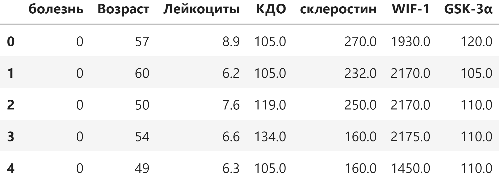
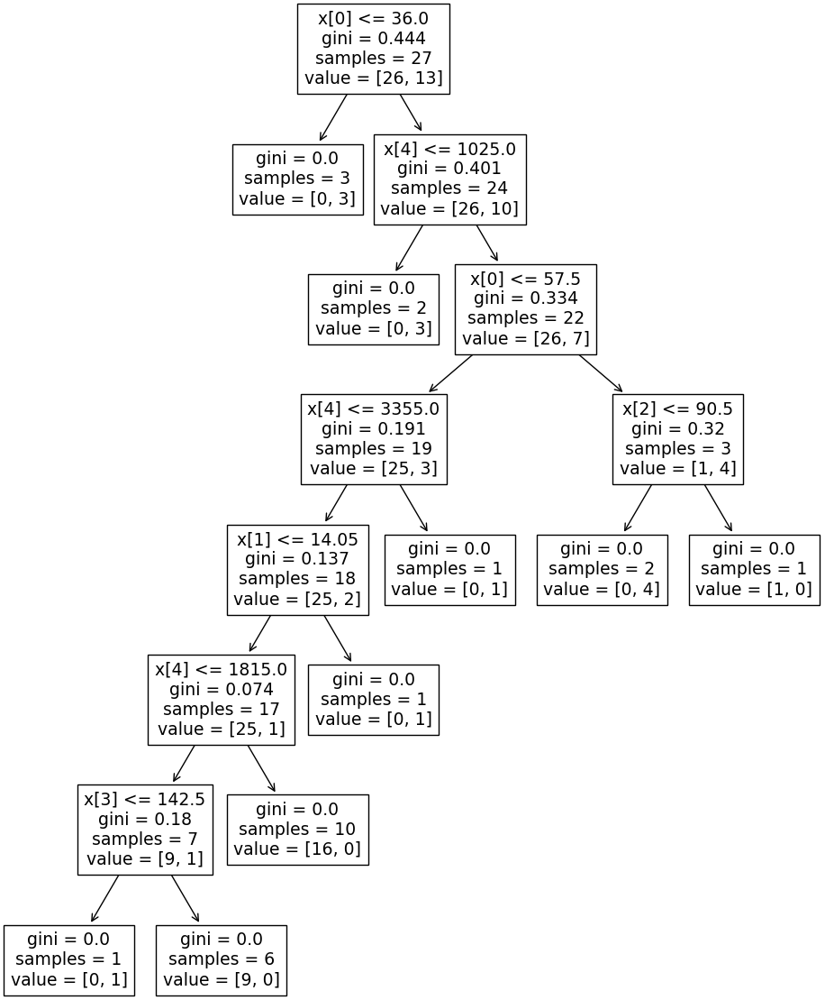

# CoroDetect

[Портфолио](https://jellywilliam.github.io)

[Ссылка на репозиторий](https://github.com/JellyWilliam/CoroDetect)

# Набор данных

Датасет состоит из различных анализов пациентов, меткой является наличие сердечно-сосудистых заболеваний

Пример данных:

# Модель

Для обучения была выбрана модель "Случайного Леса" (Random Forest) из библиотеки [scikit-learn](https://scikit-learn.org)

Ниже представлены метрики тестовых данных

Визуализация одного из деревьев поиска решения:

**Итог**: модель достигла очень хороших показателей точности

Сама модель находится в формате Picle-файла [model.pkl](model.pkl)